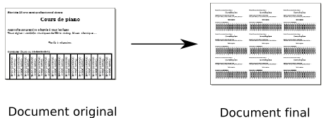
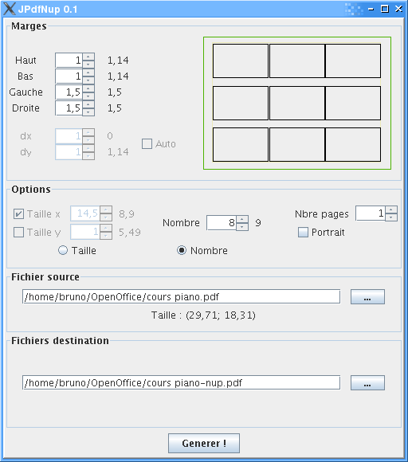

# JPdfNup
Old project to put multiple instances of a pdf in a final pdf file. Pypically for creating labels.

## Images

## Download

  * [tar file] (https://github.com/brunetton/JPdfNup/releases/download/v0.1-2/jpdfnup-0.1-2_all-inclusive.tar)
  * [debian package] (https://github.com/brunetton/JPdfNup/releases/download/v0.1-2/jpdfnup_0.1-2_all.deb)
